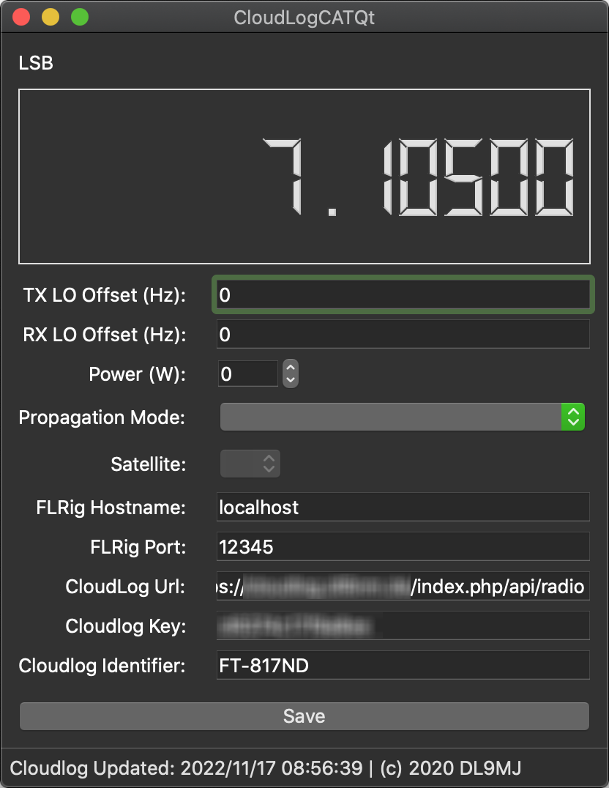
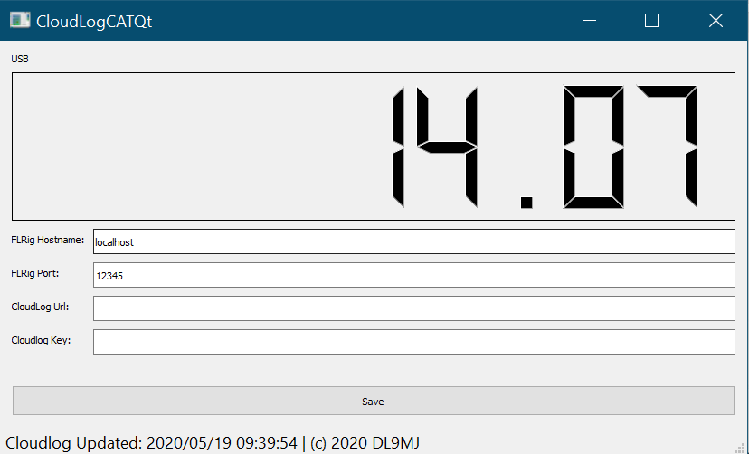

# CloudLogCatQt

Qt app that can be compiled on  Linux, Windows or Mac for providing CAT support for Cloudlog (http://www.cloudlog.co.uk/).
The app uses a connection to FlRig (http://www.w1hkj.com)

_The app is still in development and therefore it can not be considered as fully stable._

## Table of Contents

- [CloudLogCatQt](#cloudlogcatqt)
  - [Table of Contents](#table-of-contents)
  - [Build](#build)
    - [Linux](#linux)
    - [macOS](#macos)
      - [Side Notes](#side-notes)
    - [Windows](#windows)
  - [Settings](#settings)
  - [Screenshots](#screenshots)

## Build

### Linux

```bash
apt install qt5-default
git clone --recursive https://github.com/myzinsky/CloudLogCatQt.git
cd CloudLogCatQt
mkdir build
cd build
qmake ../CloudLogCatQt.pro
make -j4
```

### macOS

1. Install [Homebrew]
2. Open a Terminal
3. Run `brew install qt@5`
4. Clone this repository and _cd_ into it
5. `mkdir build`
6. `cd build`
7. `/usr/local/opt/qt@5/bin/qmake ../CloudLogCatQt.pro`
8. `make -j4`


#### Side Notes 

After successfully installing [Homebrew], take a look at the output in the terminal. You'll find a "Caveats" block having some information on the installation paths of Qt5. Maybe you have to adapt Step 7 to your needs.

_Terminal output example:_

    Caveats
    We agreed to the Qt open source license for you.
    If this is unacceptable you should uninstall.

    qt@5 is keg-only, which means it was not symlinked into /usr/local,
    because this is an alternate version of another formula.

    If you need to have qt@5 first in your PATH, run:
      echo 'export PATH="/usr/local/opt/qt@5/bin:$PATH"' >> /Users/michael/.bash_profile

    For compilers to find qt@5 you may need to set:
      export LDFLAGS="-L/usr/local/opt/qt@5/lib"
      export CPPFLAGS="-I/usr/local/opt/qt@5/include"

### Windows

For building CloudLogCatQt on Windows 10 follow the steps below.

1. Install [Chocolatey] (The Package Manager For Windows)
2. Open an elevated PowerShell and run  
    `choco install -y qt5-default cmake qtcreator`
3. Clone this repository
4. Start _QT Creator_
5. Open project file [CloudLogCatQt.pro]()
6. Change the projects build settings for _Release_ and add a _Custom Process Step_
     - Command: `%{Qt:QT_INSTALL_BINS}\windeployqt.exe`
    - Arguments: `%{buildDir}\release`
    - Working directory: `%{buildDir}\release`
7. Click on _Build Project_ [`CTRL+B`]
8. The release and all it's dependencies should now be located in the _Build directory_ as defined in the Projects Build Settings (e.g. in _build-CloudLogCatQt-Desktop-Release/release_ next to your project)

_Read more on the deployment process: [Qt for Windows - Deployment]_

## Settings

The settings are almost self explaining. According to https://github.com/magicbug/Cloudlog/wiki/API create an API key and fill this together with your CloudLog URL e.g. ```https://<CloudLogServer>/index.php/api/radio``` into the settings pane. Furthermore, add the conneciton to FlRig. The default settings are ```localhost``` and the port ```12345```

## Screenshots

**macOS**



**Windows**




[Chocolatey]: https://chocolatey.org/install
[Homebrew]: https://brew.sh
[Qt for Windows - Deployment]: https://doc.qt.io/qt-5/windows-deployment.html
